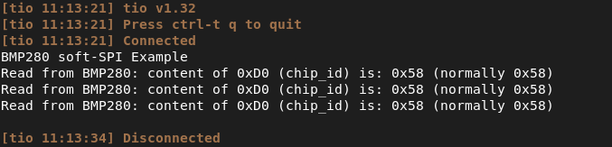

# STM32F4 SPI BMP280 example

## Description

This example uses STMicroelectronics STM32F411CE Microcontroller on a custom devboard.
A Software-SPI implementation is used to communicate with the BMP280 to validate its chip-id.
USART1 (baudrate 1191) is used to print out the received chip-id register.

## Usage

Build the project using make:
```console
make build
```

and download the image to your target over USB:
```console
make flash-usb
```
or over USART using a USB to UART bridge:
```console
make flash-usart
```

## Output

after connecting the USART1 pins to an external USB to UART bridge and opening that USB port @ 1191baud the following text will be printed:



## SPI Communication

for a better understanding on how the SPI protocol works, the pins SCK, MOSI, MISO and CS were captured by a logic analyzer:


## Troubleshooting

When encountering an error during flashing make sure your USB device port on your machine matches the port in the Makefile.